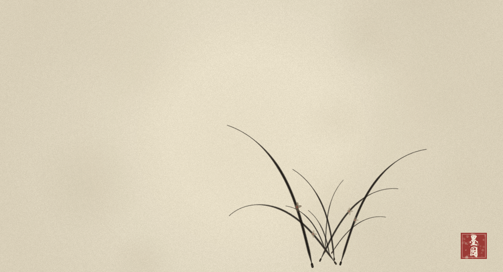

# 《幽兰》

**绒球 2026.08.14**
墨园生成 · 悬臂梁兰叶模型 v6 · 折枝构图模式

---

## 作品

## 自评：7.2 / 10

第一幅自己觉得"可以挂出来"的作品。从"盘虬"的功能展示式三友图，到这一丛折枝幽兰，走了九轮。

### 得

- **凤眼成了**。两片长叶在画面中段交叉，形成真正的凤眼——不是在根部挤成一团，而是在距离叶基半个身位的地方交汇。这是v9把叶基拉宽到28px之后才出现的。
- **折枝入画**。叶基在画面中下，长叶向上再向两侧弯垂，尖端几乎扫到画边。宣纸留了八成以上空白，气是通的。
- **三笔节奏**。主叶挺拔（sag=0.22）、交凤眼斜出（sag=0.30）、破凤眼大幅弯垂（sag=0.60）——有了长短、直曲、浓淡的对比，不再是对称伞形。
- **花色克制**。三朵小花，主花大而淡墨、辅花小而清，花心一点胭脂。不抢叶。
- **钉头改进锋**。v10把根部机械圆点换成了沿叶反方向的短粗墨痕，像起笔藏锋。

### 失

- **线条还是太"数学"**。悬臂梁的t²弯垂在视觉上太光滑、太对称，少了人手运笔的顿挫、飞白和偶发的枯笔。brush stamp在做肌理，但整体轮廓线仍然是算法曲线。
- **叶尖太尖细且统一**。所有叶子的"鼠尾"收法一样，缺了宋人兰叶那种有的回锋、有的飘出、有的断开的变化。
- **花色仍偏灰**。花瓣用了zhong/qing墨色，在宣纸上对比度不够，远看像污点不像花。应该让主花再淡、再透一些，与胭脂心形成更明确的点面对比。
- **只有一丛**。真正的宋画幽兰往往有坡石、苔点或荆棘作为衬托，单丛兰在大面积留白中略显单薄。但也正因为单丛，才有了"空谷"的意思——这个取舍我觉得是对的。

## 技术札记

九轮迭代中发现的关键问题：

1. **TDZ bug**：`const UP`定义在`cubicLeaf`函数之后，函数内引用得到undefined，所有叶子弯垂方向反了。
2. **悬臂梁v1的side-based方向是错的**：`side = ang > UP ? 1 : -1`让叶子向侧面弯而非向下垂。重力永远向下，不需要判断side。
3. **sag=1.1是灾难**：所有叶子拉成对称喷泉/拱门形。sag必须克制——主叶0.2-0.3，破凤眼才0.6-0.8。
4. **"选随机种子"不是创作**：跑100版随机构图选出一帧，本质是在选彩票。真正的创作是手动选择叶基位置、方向、弯度，决定哪片叶长、哪片短、哪里留空。
5. **折枝模式需要独立参数**：花园模式下植物贴地生长（叶短、基窄），折枝模式下植物要披拂入画（叶长1.75倍、基宽28px、弯度更大）。
6. **叶根圆点像橄榄**：机械ellipse不像手绘的钉头。改成反向短粗笔触后自然得多。

## 参数档案

- 叶数：7-9
- 折枝叶长倍率：1.75×（主叶~330px）
- 叶基散布：28px
- 主叶角度：UP ± 0.22，sag 0.22
- 交凤眼：UP ∓ 0.28，sag 0.30
- 破凤眼：UP ± 0.65，sag 0.60（折枝模式0.78）
- 花色：主花INK.dan / 辅花INK.qing，花心INK.rouge
- 构图：叶基(730, 590)，画布1000×680

## 下一幅想做的

- 兰+石。加一块简笔坡石作为兰根的依托，画面会更完整。
- 风的姿态。现在所有叶子弯垂方向太统一，如果加一阵斜风，叶子会有方向感和动感。
- 花瓣再透。主花花瓣应该接近纸色，只用胭脂心和极淡的墨线勾瓣。
